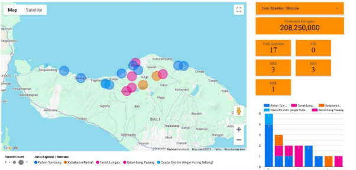



Pemetaan bencana

1\. pohon tumbang : sumberkima, gerokgak, tegal linggah, banjar, buleleng, gitgit, tejakula

2\. tanah longsor : buleleng, gitgit, wanagiri, gobleg

3\. kebakaran : gitgit, sawan

4\. banjir : banjar, seririt, kampung tinggi

5\. 

Deskripsi bencana:

1. Tanah Longsor: Tanah longsor adalah suatu peristiwa geologi di mana terjadi pergerakan massa tanah atau batuan yang meluncur keluar dan ke bawah lereng. Secara sederhana, tanah longsor terjadi karena gangguan kestabilan pada tanah atau batuan penyusun lereng tersebut.
1. Banjir: Banjir adalah peristiwa terendamnya suatu daerah atau daratan yang biasanya kering karena volume air yang meningkat. Banjir terjadi ketika air meluap dari saluran (sungai, danau, atau selokan) atau ketika air hujan tidak dapat meresap ke dalam tanah dengan cukup cepat.
1. Gempa Bumi: Gempa bumi adalah getaran atau guncangan yang terjadi di permukaan bumi akibat pelepasan energi dari dalam secara tiba-tiba. Pelepasan energi ini menciptakan gelombang seismik yang merambat ke seluruh bagian bumi dan merusak struktur bangunan di atasnya.
1. Angin Puting Beliung: Angin Puting Beliung adalah pusaran angin kencang yang keluar dari awan badai (Cumulonimbus) dan menyentuh permukaan bumi. Di luar negeri, fenomena yang serupa namun dalam skala jauh lebih besar dikenal dengan sebutan *Tornado*.
1. Tsunami: Tsunami berasal dari bahasa Jepang: *tsu* (pelabuhan) dan *nami* (gelombang). Secara ilmiah, tsunami adalah serangkaian gelombang laut raksasa yang timbul karena adanya pergeseran massa air laut dalam skala besar secara mendadak.

Penanggulangan bencana

1. Banjir
1. Pra-Bencana (Pencegahan & Persiapan)

   Langkah terbaik adalah memastikan lingkungan siap menghadapi debit air yang tinggi.

- Pembersihan Drainase: Pastikan selokan di depan rumah tidak tersumbat sampah atau sedimen tanah.
- Penyediaan Daerah Resapan: Kurangi penggunaan semen/beton di halaman rumah. Gunakan biopori atau paving block agar air meresap ke tanah.
- Tas Siaga Bencana (TSB): Siapkan tas berisi dokumen penting (ijazah, sertifikat), obat-obatan, senter, powerbank, dan pakaian dalam wadah kedap air.
- Peninggian Instalasi Listrik: Posisikan stop kontak dan panel listrik lebih tinggi dari titik maksimal banjir yang pernah terjadi.
- Simak Informasi Cuaca: Pantau informasi dari BMKG (Badan Meteorologi, Klimatologi, dan Geofisika) melalui aplikasi atau media sosial.
1. Saat Terjadi Banjir (Tanggap Darurat)

Fokus pada keselamatan fisik dan pencegahan kecelakaan arus pendek listrik.

- Matikan Listrik & Gas: Segera matikan aliran listrik dari meteran (MCB) dan lepas regulator gas untuk mencegah kebakaran atau sengatan listrik.
- Evakuasi Dini: Jangan menunggu air setinggi dada. Jika air mulai masuk ke rumah, segera amankan anggota keluarga ke tempat yang lebih tinggi.
- Hindari Berjalan di Arus Air: Arus setinggi 15 cm sudah mampu menjatuhkan orang dewasa. Waspadai juga lubang selokan yang tidak terlihat karena tertutup air.
- Gunakan Alas Kaki: Selalu gunakan sepatu atau sandal untuk menghindari luka akibat benda tajam (kaku, kaca) atau gigitan hewan (ular/lipan) yang keluar saat banjir.
1. Pasca-Bencana (Pemulihan & Sanitasi)

Waspadai penyakit pasca-banjir seperti leptospirosis, diare, dan penyakit kulit.

- Pembersihan Segera: Bersihkan lantai dan dinding dari lumpur menggunakan disinfektan untuk membunuh kuman.
- Periksa Instalasi Listrik: Jangan menyalakan listrik sebelum dipastikan benar-benar kering oleh teknisi atau pihak PLN.
- Waspadai Sarang Hewan: Periksa celah-celah rumah, lemari, atau tumpukan kain yang mungkin menjadi tempat bersembunyi ular atau kalajengking setelah air surut.
- Pengelolaan Sampah: Segera buang sampah basah agar tidak menjadi sarang lalat dan nyamuk.
1. TANAH LONGSOR
1. Pra-Bencana (Pencegahan & Kesiapsiagaan)

Langkah yang dilakukan sebelum hujan turun atau sebelum bencana terjadi.

- Tutup Retakan Tanah: Segera urug retakan tanah di lereng atau sekitar rumah dengan tanah liat/semen agar air hujan tidak masuk ke dalam tanah.
- Kelola Aliran Air (Drainase): Pastikan air hujan mengalir lancar di selokan semen dan tidak merembes liar ke dalam tebing.
- Tanam Pohon Berakar Kuat: Hijaukan lereng dengan tanaman seperti Vetiver (rumput akar wangi), Bambu, atau Mahoni yang akarnya mampu mengikat tanah.
- Hindari Beban Berlebih: Jangan membangun rumah, membuat kolam ikan, atau sawah di bagian atas lereng yang terjal.
- Siapkan Tas Siaga Bencana (TSB): Siapkan tas berisi dokumen penting, senter, peluit, dan obat-obatan di dekat pintu keluar.
1. Saat Terjadi Bencana (Tanggap Darurat)

Langkah penyelamatan diri ketika tanda-tanda longsor muncul atau saat kejadian.

- Segera Evakuasi: Jika terdengar suara gemuruh dari bukit atau terlihat pohon miring, segera lari keluar rumah menuju tanah lapang/datar.
- Gunakan Alat Peringatan: Bunyikan kentongan atau sirine untuk memberi tahu tetangga agar segera menyelamatkan diri.
- Lindungi Kepala: Jika terjebak di dalam ruangan, berlindunglah di bawah meja yang kuat atau tekuk tubuh seperti bola untuk melindungi kepala dari reruntuhan.
- Jauhi Jalur Aliran: Jangan melintasi lembah, sungai, atau jalur bawah tebing karena material longsor (lumpur dan batu) bergerak sangat cepat.
- Gunakan Peluit: Jika terjebak atau tertimbun, gunakan peluit atau ketukan benda keras untuk memberi tahu posisi Anda kepada tim penolong (hemat suara Anda).
1. Pasca-Bencana (Pemulihan & Kewaspadaan)

Langkah yang dilakukan setelah situasi dirasa tenang.

- Waspada Longsor Susulan: Jangan langsung kembali ke rumah meskipun hujan sudah reda. Longsor susulan sering terjadi saat tanah masih jenuh air.
- Hindari Area Retakan: Jangan mendekati area yang baru saja longsor karena struktur tanahnya masih sangat labil.
- Laporkan Kerusakan: Segera lapor kepada pihak berwenang (RT/RW/BPBD) jika melihat adanya retakan baru atau pipa air/listrik yang terputus.
- Bantu Tim SAR: Berikan informasi yang akurat mengenai jumlah anggota keluarga atau tetangga yang mungkin masih tertimbun di lokasi kejadian.
- Pembersihan Mandiri: Lakukan pembersihan material lumpur hanya jika sudah dinyatakan aman oleh petugas ahli geologi.
1. Gempa Bumi
1. Pra-Bencana (Pencegahan & Kesiapsiagaan)

Membangun ketahanan sebelum guncangan terjadi.

- Tata Letak Furnitur: Pastikan lemari tinggi atau benda berat dipaku ke dinding (menggunakan bracket) agar tidak tumbang saat guncangan.
- Cek Struktur Bangunan: Pastikan atap dan dinding dalam kondisi kokoh. Gunakan material ringan untuk plafon.
- Identifikasi Tempat Aman: Tentukan "titik aman" di dalam rumah (di bawah meja kuat) dan "titik kumpul" di luar rumah (lapangan terbuka jauh dari tiang listrik/pohon).
- Siapkan Tas Siaga Bencana (TSB): Berisi air minum, makanan kering, senter, P3K, peluit, dan dokumen penting.
- Matikan Potensi Bahaya: Pastikan seluruh anggota keluarga tahu cara mematikan gas elpiji dan aliran listrik pusat (sekring/MCB).
1. Saat Terjadi Bencana (Tanggap Darurat)
   1. Aksi cepat untuk melindungi diri dari cedera fisik. Metode 3M (Drop, Cover, Hold On):
   - Berlutut (Drop): Jatuhkan badan ke tangan dan lutut sebelum gempa menjatuhkan Anda.
   - Lindungi Kepala (Cover): Masuk ke bawah meja yang kokoh. Jika tidak ada meja, lindungi kepala dengan lengan/bantal di pojok ruangan.
   - Bertahan (Hold On): Pegang kaki meja hingga guncangan berhenti.
   1. Jangan Gunakan Lift: Jika berada di gedung bertingkat, gunakan tangga darurat. Jangan berlari keluar saat guncangan masih terjadi karena risiko tertimpa kaca/material gedung.
   1. Jauhi Kaca & Benda Gantung: Hindari berdiri dekat jendela, cermin, atau lampu gantung.
   1. Di Luar Ruangan: Cari lahan terbuka. Jauhi gedung, tiang listrik, pohon, dan papan reklame.
   1. Di Dalam Kendaraan: Berhenti di tempat terbuka (jauhi jembatan/flyover) dan tetaplah di dalam mobil sampai guncangan berhenti.
1. Pasca-Bencana (Pemulihan & Kewaspadaan)

Langkah setelah guncangan berhenti.

1. Waspada Gempa Susulan: Biasanya terjadi beberapa kali setelah gempa utama. Tetaplah berada di titik kumpul luar ruangan.
1. Periksa Kebocoran: Cek bau gas, percikan kabel listrik, dan retakan bangunan sebelum masuk kembali ke rumah.
1. Jauhi Area Pantai: Jika gempa terasa sangat kuat (lebih dari 20 detik) dan Anda berada di pantai, segera lari ke tempat tinggi tanpa menunggu peringatan tsunami.
1. Gunakan Telepon Hanya untuk Darurat: Hindari menelpon untuk sekadar mengobrol agar jaringan tidak sibuk (gunakan pesan teks/WhatsApp untuk memberi kabar).
1. Simak Informasi Resmi: Pantau update dari BMKG untuk mengetahui magnitudo dan potensi tsunami.
1. TSUNAMI
1. Pra-Bencana (Pencegahan & Kesiapsiagaan)

Langkah antisipasi sebelum ancaman air laut muncul.

1. Pahami Geografi Lokal: Ketahui jarak rumah Anda dari bibir pantai dan ketinggian wilayah Anda di atas permukaan laut.
1. Kenali Jalur Evakuasi: Hafalkan jalur menuju tempat yang lebih tinggi (minimal 20 meter di atas permukaan laut) atau bangunan vertikal yang sudah ditentukan (TES - Tempat Evakuasi Sementara).
1. Prinsip 20-20-20: Jika gempa terasa selama 20 detik, segera evakuasi dalam waktu 20 menit, menuju ketinggian minimal 20 meter.
1. Simak Peringatan Dini: Pahami bunyi sirine tsunami di daerah Anda. Jika berbunyi tanpa henti, itu adalah perintah evakuasi segera.
1. Tanam Mangrove: Secara komunitas, menanam bakau di pesisir dapat membantu memecah energi gelombang sebelum mencapai daratan.
1. Saat Terjadi Bencana (Tanggap Darurat)

Aksi cepat saat peringatan dini aktif atau tanda alam terlihat.

1. Tanda Alam (Peringatan Alami): Jika setelah gempa air laut tiba-tiba surut drastis hingga ikan-ikan terdampar, jangan mendekat untuk mengambil ikan. Segera lari sejauh mungkin dari pantai.
1. Evakuasi ke Tempat Tinggi: Segera menuju perbukitan atau lantai atas bangunan beton yang kokoh (minimal lantai 3).
1. Jangan Gunakan Mobil: Jika memungkinkan, evakuasi dengan jalan kaki atau motor agar tidak terjebak macet. Kemacetan adalah penyebab utama korban jiwa pada tsunami.
1. Lepas Alas Kaki yang Menghambat: Jika harus berenang, lepaskan sepatu berat atau benda yang bisa menenggelamkan Anda.
1. Bertahan pada Benda Terapung: Jika terseret arus, carilah benda yang terapung kuat (seperti batang pohon, pintu, atau kasur) untuk dijadikan pelampung.
1. Pasca-Bencana (Pemulihan & Kewaspadaan)

Langkah setelah gelombang pertama surut.

1. Jangan Langsung Kembali: Tsunami biasanya terdiri dari beberapa gelombang (gelombang kedua atau ketiga seringkali jauh lebih besar dari yang pertama). Tunggu arahan "Status Aman" dari BMKG.
1. Waspadai Kabel Listrik: Hindari genangan air yang bersentuhan dengan kabel listrik yang jatuh.
1. Hati-hati dengan Bangunan Rusak: Struktur bangunan yang terkena hantaman tsunami biasanya menjadi sangat rapuh dan mudah roboh.
1. Cek Sumber Air Bersih: Air sumur biasanya akan tercemar air asin dan bakteri setelah tsunami. Gunakan air kemasan untuk konsumsi.
1. Angin Puting Beliung
1. Pra-Bencana (Kesiapsiagaan)

Langkah antisipasi untuk memperkecil dampak kerusakan rumah.

1. Pangkas Dahan Pohon: Tebang dahan pohon yang sudah rimbun atau rapuh di sekitar rumah agar tidak tumbang menimpa bangunan saat angin kencang.
1. Perkuat Atap: Pastikan paku atau baut pada atap seng/asbes terpasang kuat. Angin puting beliung sering kali "mengangkat" atap yang longgar.
1. Cek Kondisi Dinding: Pastikan tidak ada keretakan struktur yang bisa menyebabkan bangunan roboh saat terkena tekanan angin.
1. Edukasi Tanda Alam: Ajarkan keluarga mengenali awan Cumulonimbus (awan hitam pekat, berbentuk seperti bunga kol yang menjulang tinggi). Biasanya disertai petir dan udara yang tiba-tiba menjadi sangat dingin.
1. Saat Terjadi Bencana (Tanggap Darurat)

Aksi penyelamatan diri saat pusaran angin terlihat atau terdengar.

1. Jika Di Dalam Ruangan:
   - Segera cari tempat perlindungan di bagian dalam bangunan (kamar mandi atau kolong meja yang kuat).
   - Jauhi Jendela & Pintu Kaca: Tekanan angin bisa memecahkan kaca dan serpihannya sangat berbahaya.
   - Berlindung di pojok ruangan dan lindungi kepala dengan bantal atau tangan (posisi meringkuk).
1. Jika Di Luar Ruangan:
   - Hindari berteduh di bawah pohon, papan reklame, atau tiang listrik.
   - Segera cari bangunan yang kokoh dan permanen.
   - Jika tidak ada bangunan sama sekali, tiaraplah di area yang rendah (seperti parit atau cekungan tanah) sambil melindungi kepala dengan tangan.
1. Jika Di Dalam Kendaraan:
   - Segera keluar dari mobil dan cari perlindungan di bangunan kokoh atau tiarap di tempat rendah. Jangan mencoba balapan atau mengejar arah angin dengan mobil.
1. Pasca-Bencana (Pemulihan & Keselamatan)

Langkah aman setelah angin berlalu.

1. Waspadai Kabel Terputus: Jangan menyentuh atau mendekati kabel listrik yang jatuh ke tanah karena mungkin masih bertegangan.
1. Periksa Struktur Atap: Sebelum masuk kembali ke rumah, cek apakah atap masih stabil atau ada bagian yang hampir jatuh.
1. Gotong Royong Bersama: Bersihkan puing-puing bangunan atau pohon yang tumbang yang menghalangi jalan akses darurat.
1. Dokumentasi Kerusakan: Ambil foto kerusakan untuk keperluan pelaporan ke BPBD atau pihak terkait guna mendapatkan bantuan perbaikan.

